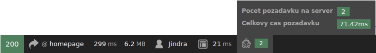
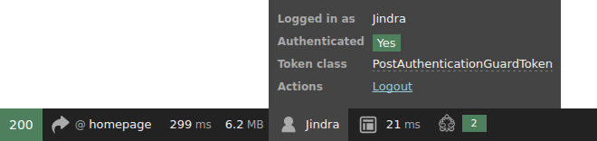
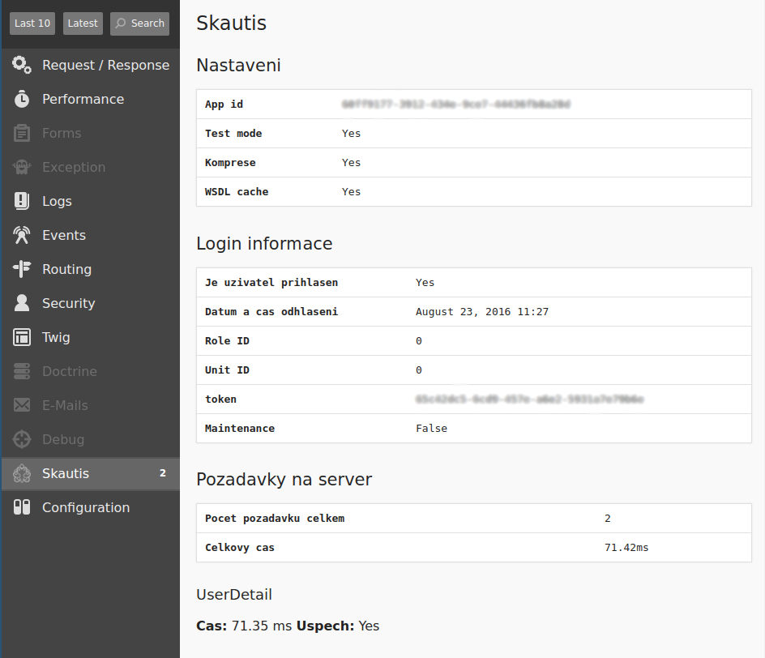
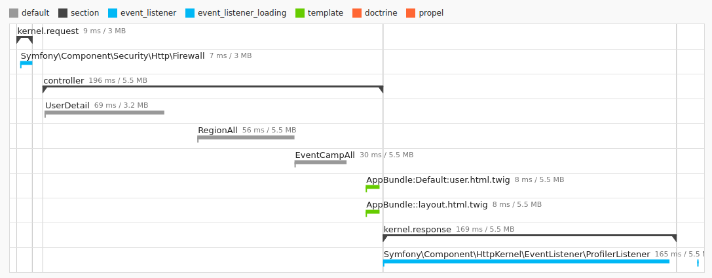
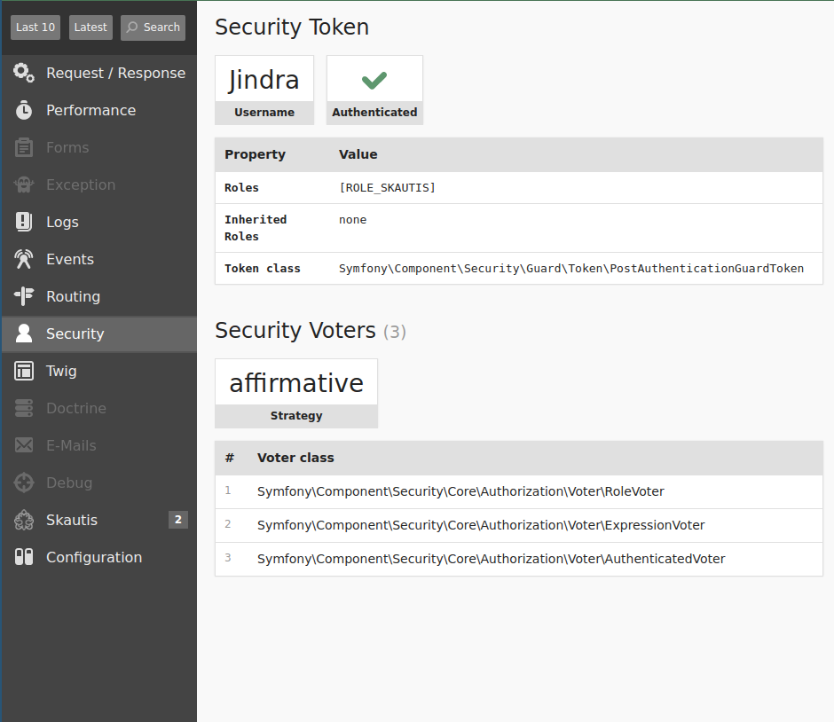

#Ukazky integrace

##Debug panel dava zakladni informace
Zakladni informace jsou videt ihned na debug panelu.

Informace o pozadavcich na Skautis

Informace o uzivateli prihlasenem pres Skautis

##Vlastni debug stranka
SkautisBundle pridava vlastni stranku obsahujici informace o nastaveni.

##Integrace s profilerem
Profiler zobrazuje kolik casu casti aplikace trvaji. 
Na screenshotu je videt controller ktery obsahuje 3 volani na Skautis ``UserDetail``, ``EventAll`` a ``EventCampAll``.

##Prihlaseni do Skautisu je propojeno se Symfony loginem (volitelne)
Username je nacteno ze skautisu a vsem uzivatelum prihlasenym pres Skautis je pridana role ``ROLE_SKAUTIS``

